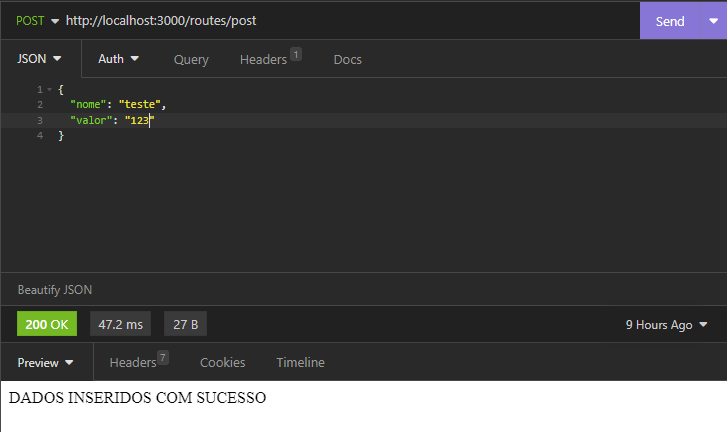
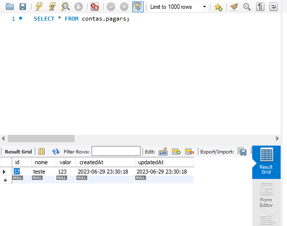

# Rota que insere dados no banco

## Prazer, eu sou o João, tenho 21 anos, sou estudante de tecnologia, atualmente cursando o curso de Sistema da Informação. Estou em busca da minha primeira oportunidade como desenvolvedor Junior para colocar em prática os conhecimentos adquiridos e crescer profissionalmente nessa área fascinante. Sou dedicado, entusiasmado e estou sempre buscando aprender mais para me tornar um profissional competente. Estou aberto a desafios e ansioso para contribuir em projetos de desenvolvimento. Agradeço a oportunidade de me apresentar e estou disponível para mais informações e para compartilhar meu trabalho no <a href="https://www.linkedin.com/in/joão-lucas-pereira-medeiros-1a527a1a0/"> LinkedIn.</a>
#  
# Dependencias do projeto:
    
        "dependencies": {
        "body-parser": "^1.20.2",
        "express": "^4.18.2",
        "express-handlebars": "^7.0.7",
        "mysql": "^2.18.1",
        "mysql2": "^3.4.2",
        "sequelize": "^6.32.1",
        "sqlite3": "^5.1.6"
         }
    

# 1. CONECTAR AO BANCO 
## Para que essa conexão funcione corretamente, é necessário que um banco de dados já tenha sido previamente criado. No exemplo fornecido, é utilizado o banco de dados "contas", que foi criado usando o MySQL
## Ainda não estamos "criando" o banco usando Sequelize apenas fazendo a conexão

    const Sequelize = require('sequelize');

    const connection = new Sequelize('contas', 'joaoone', '123456', {
    host: 'localhost',
    dialect: 'mysql'
    });

    module.exports = connection;
   
## Dentro do nosso arquivo principal, o objeto "authenticate" valida se a conexão entre <strong> banco </strong> e <strong>Sequelize</strong> está  funcionando corretamente nos retornando uma promessa, onde o <strong> then() </strong>quando NÃO encontrado nenhum erro ira exibir no terminal a mensagem "Banco conectado com sucesso" caso encontre algum erro o <strong> catch() </strong> recebe como parametro "err" quando existir algum erro, exibirá no terminal a mensagem "Erro ao conectar ao banco" mais o erro encontrado na conexão.

    const connection = require('./db/connection');

    connection
    .authenticate()
    .then(()=> {
        console.log('Banco conectado com sucesso');
    })
    .catch(err =>{
        console.log('erro ao conectar ao banco ',err)
    });
## Conexão com sucesso - mensagem no terminal
    Executing (default): SELECT 1+1 AS result
    Banco conectado com sucesso
## Falha na conexão - mensagem no terminal 
    erro ao conectar ao banco -> erro econtrado (AccessDeniedError)

# 2. CRIAR AS MODELS
## As models são uma abstração do banco de dados criando, pode se entender como um espelho com as configuração do nosso banco de dados
## para as models funcionar corretamente é necessario que existe algum banco criando.
## dentro do banco de dados no mysql existe um banco chamado "contas" com tabelas chamadas, nome e valor, agora precisamos informar isso para o sequelize, o sequelize usado o objeto <strong>.define()</strong> onde o primeiro parametro refere-se ao nome do banco e o segundo aos campos da tabela.
## As variaveis "connection" refere-se ao passo 1 onde criamos a conexão com o banco

    const Sequelize = require('sequelize');
    const connection = require('../db/connection');
    const contas = connection.define('pagar', {
    nome: {
        type: Sequelize.STRING,
    },
    valor: {
        type: Sequelize.DOUBLE,
    }
    });

    module.exports = contas;

# 3. BODY-PARSER

## Antes de criar uma rota do tipo "POST" para inserir dados no banco, é necessário instalar o "body-parser" para receber e processar dados em formato JSON. Ao utilizar o Sequelize, podemos interagir com o banco de dados para executar operações de inserção, atualização, exclusão, etc.

    const bodyParser = require('body-parser');
    app.use(bodyParser.urlencoded({extended:false}))
    app.use(bodyParser.json());

# 4. ROTA POST
## Criaremos uma rota do tipo POST para inserir dados no banco, usando o objeto "create".Mas antes precisamos definir uma variavel que receba esses dados da requisição.
  
    const {nome, valor} = req.body;
    //outra forma para criar variaveis
    const nome = req.body;
    const valor = req.body;
## agora usaremos o "create" para inserir um novo registro no banco de dados na tabela "pagar"

    pagar.create({
    nome:nome,
    valor:valor
    })
## podemos usar o then e o catch para validadar um tipo de inconformidade na rota
    .then(()=>{
    res.send('DADOS INSERIDOS COM SUCESSO')
    })
    .catch((error)=>{
    console.log(`erro na rota post ${error}`)
    });

## para verificar se a rota está funcionando corretamente, vamos usar "insomnia" para teste da rota
#  
# 5. ENVIANDO DADOS PARA O BANCO
## Dentro do insomnia valor usar a rota do tipo "POST".
## Passando na URL a rota criada, tipo arquivo "JSON" passando dentro "{ }" o "variavel: valorAtribuida"
# 
# Vizualizando no banco
# 
## E fim!!

